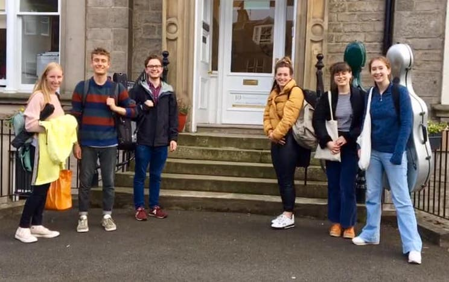

EUSO is passionate about engaging with the community in Edinburgh and helping to spread the joy of music to everyone. We frequently work with care homes and charities and perform pop up concerts in public spaces such as Waverley Mall. EUSO also organises interactive education projects for schools, helping to spark an interest in music and allowing students to engage with and explore instruments close up.

If you are interested in organising a project with us or would like to find out more about the work we do, please [contact](/contact/) our Outreach Officers Anoukia and Will.