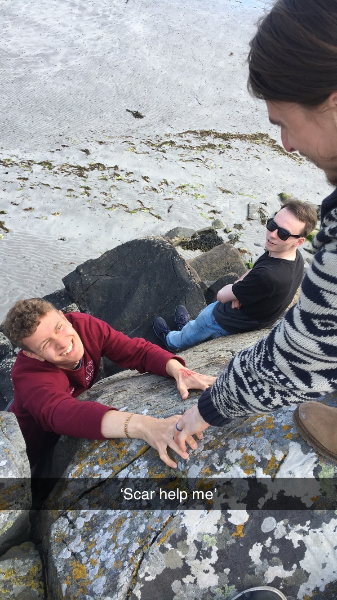
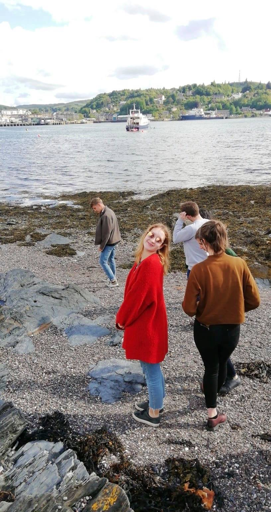
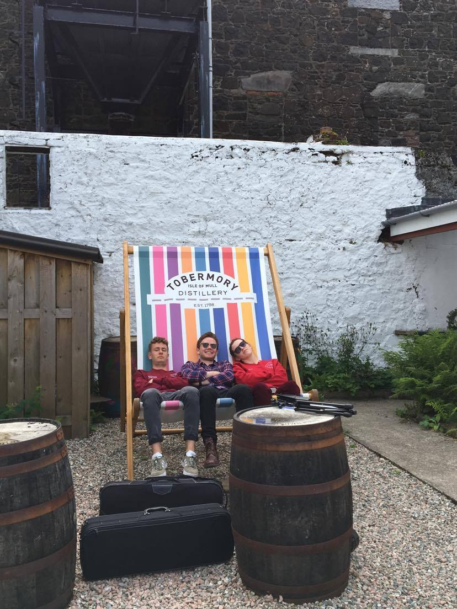
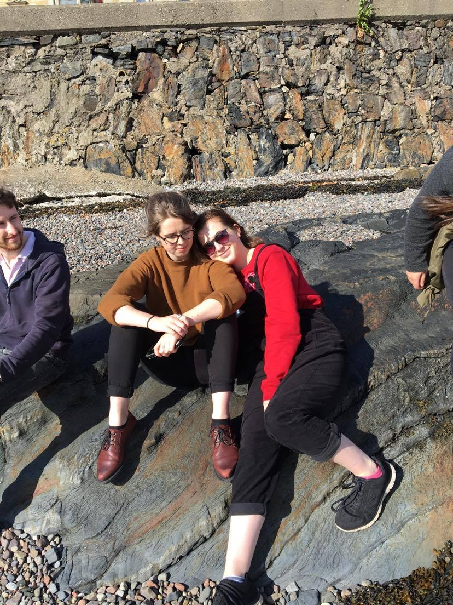

*Join us on our annual tour to a remote part of Scotland.*

Every year, EUSO goes on its famous tour to showcase its talents to the communities of Scotland. It's a great opportunity to get out of the bustle of Edinburgh and escape to the idyll of a distant part of Scotland, as well as to play some exciting repertoire and make lifelong friends.

Tour is not restricted to EUSO members - in fact we encourage everyone to come along! The more the merrier! If you would like to join us, please speak to our tour manager, Raphael Gould.

In previous years, the orchestra has had great fun entertaining the people of Mull, Iona, Skye and Arran. The orchestra recently visited the Ullapool area and gave performances in the Ullapool Church of Scotland, Poolewe Village Hall and a chamber music concert in the Aultbea Hotel.

Here are some random pictures from the EUSO Tour 2019:

